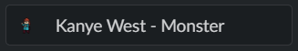

# lastfm slack status

## screenshot

## usage

- install the dependencies from requirements.txt
  `pip install requirements.txt`
- make a .env file (use env.example for format) and add the keys
  - get the `SLACK_TOKEN` by creating a slack app.
  - get the `LASTFM_KEY` by creating a last.fm developer account.
- run main.py
  `python main.py`
